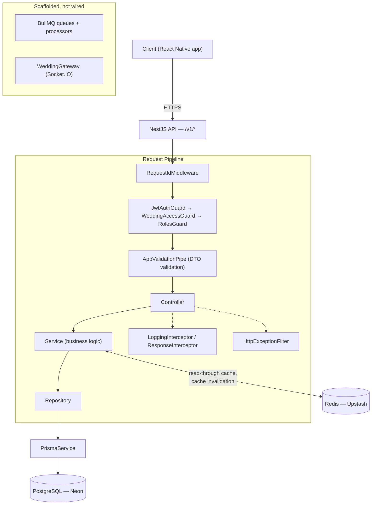
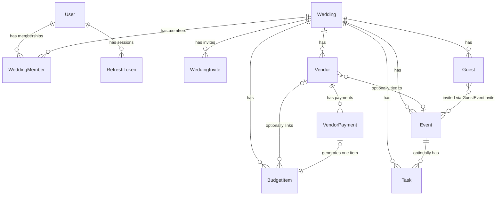

# Smart Wedding Management API

A multi-tenant **Wedding Management Platform** backend — one couple's wedding is a workspace shared by an owner, co-owners, family members, and viewers, covering vendors, guests & RSVPs, budget, timeline events, and tasks, with a live dashboard summarizing progress across all of them.

Built with **NestJS**, **PostgreSQL** (via **Prisma ORM**), and **Redis**, deployed as a Docker container on **Render** with Postgres on **Neon** and Redis on **Upstash**.

[](https://github.com/Chuck672991/WMS_backend/actions/workflows/ci.yml)

---

## Table of Contents

- [Project Overview](#project-overview)
- [Features](#features)
- [Tech Stack](#tech-stack)
- [System Architecture](#system-architecture)
- [Folder Structure](#folder-structure)
- [Module Overview](#module-overview)
- [Database Overview](#database-overview)
- [API Architecture](#api-architecture)
- [Authentication & Authorization](#authentication--authorization)
- [Environment Variables](#environment-variables)
- [Installation Guide](#installation-guide)
- [Running the Project](#running-the-project)
- [Development Workflow](#development-workflow)
- [Available Scripts](#available-scripts)
- [Code Structure & Conventions](#code-structure--conventions)
- [Error Handling Strategy](#error-handling-strategy)
- [Validation Strategy](#validation-strategy)
- [Security Considerations](#security-considerations)
- [Logging Strategy](#logging-strategy)
- [Deployment Notes](#deployment-notes)
- [Future Enhancements](#future-enhancements)
- [Contributing Guidelines](#contributing-guidelines)
- [License](#license)
- [Author](#author)

---

## Project Overview

Planning a wedding involves coordinating vendors, tracking a budget, managing a guest list across two families, running a multi-day event timeline, and delegating tasks — usually across several people with different levels of trust. This API models that directly: a **Wedding** is a workspace, and a **WeddingMember** row grants a specific person a specific role (`OWNER`, `CO_OWNER`, `FAMILY_MEMBER`, `VIEWER`) *within that wedding* — the same user can be an `OWNER` of their own wedding and a `VIEWER` invited to help plan a relative's.

Every domain module (vendors, guests, budget, events, tasks) is scoped under `/v1/weddings/:weddingId/...` and enforces that per-wedding role on every write, while a dashboard endpoint aggregates all of them into a single progress view.

## Features

Grounded in what's actually implemented today:

- **Multi-tenant wedding workspaces** with role-based membership (`OWNER` / `CO_OWNER` / `FAMILY_MEMBER` / `VIEWER`) and email-based invites (accept/revoke, 7-day token expiry).
- **Authentication**: email/password registration & login, Google OAuth (ID token verification), JWT access + refresh tokens with **rotation and reuse detection** (reusing a revoked refresh token revokes every session for that user), password reset flow, session listing/logout/logout-all.
- **Vendor management**: CRUD, categorized (11 categories + custom), payment tracking with a derived booking status (`PENDING` / `ADVANCE` / `PAID`) computed from payments vs. total price — no stored status to drift out of sync.
- **Guest management**: CRUD, CSV/XLSX bulk import, per-guest RSVP tracking, a **public, unauthenticated RSVP link** (`/v1/public/rsvp/:rsvpToken`) so guests can respond without an account, and invite-send tracking with a 24h resend cooldown.
- **Budget tracking**: itemized budget entries with categories, and automatic budget-item creation/deletion whenever a vendor payment is recorded/removed — the two ledgers never drift apart because one is derived from the other.
- **Event timeline**: named events with computed status (`UPCOMING` / `DONE` / `CANCELLED` / `POSTPONED`) derived from the event date, optionally overridden manually.
- **Task management**: assignable tasks with status and priority, optionally linked to a specific event.
- **Dashboard**: a single aggregated endpoint (progress %, budget, guests, vendors, next event) backed by a 60-second Redis read-through cache, invalidated on every relevant write.
- **Health check** (`GET /health`): live PostgreSQL and Redis connectivity checks via `@nestjs/terminus`, returning HTTP 200/503 for use by Docker, Render, and uptime monitors.
- **Swagger/OpenAPI docs** at `/docs` with bearer-token auth wired in.

> **Scaffolded but not yet active** — present in the codebase as an intentional foundation for future work, not currently exercised by the running app: a BullMQ `QueueModule` and two job processors (`notifications`, `reminders`) with empty handlers and no registered queues; a Socket.IO `WeddingGateway` with no event handlers, not registered in any module; `ai/`, `notifications/`, and `uploads/` module directories containing only placeholders; an `s3` config namespace with no code reading it. See [Future Enhancements](#future-enhancements).

## Tech Stack

| Layer | Technology |
| --- | --- |
| Runtime | Node.js 20, TypeScript |
| Framework | [NestJS](https://nestjs.com/) 11 (Express platform) |
| Database | PostgreSQL (hosted on [Neon](https://neon.tech)) |
| ORM | [Prisma](https://www.prisma.io/) 6 |
| Cache | Redis (hosted on [Upstash](https://upstash.com)) via `ioredis` |
| Auth | `@nestjs/jwt`, `@nestjs/passport`, `passport-jwt`, `passport-google-oauth20`, `bcrypt` |
| Validation | `class-validator` / `class-transformer` |
| Rate limiting | `@nestjs/throttler` |
| Docs | `@nestjs/swagger` |
| Health checks | `@nestjs/terminus` |
| Background jobs (scaffolded) | `@nestjs/bullmq` / `bullmq` |
| Realtime (scaffolded) | `@nestjs/websockets` / `@nestjs/platform-socket.io` |
| Containerization | Docker (multi-stage, `node:20-alpine`) |
| CI/CD | GitHub Actions |
| Hosting | Render.com (also includes a Vercel serverless entrypoint, see [Deployment Notes](#deployment-notes)) |

## System Architecture

A conventional layered NestJS architecture: every module follows **Controller → Service → Repository → PrismaService**, and only the Repository layer ever touches Prisma directly — services never import `PrismaService`, which keeps persistence concerns isolated and each layer independently testable.



Cross-cutting concerns are applied globally in `create-app.ts` rather than per-controller: `RequestIdMiddleware` (correlation IDs), `AppValidationPipe`, `HttpExceptionFilter`, `LoggingInterceptor` + `ResponseInterceptor`. Authentication and authorization, by contrast, are **not global** — `JwtAuthGuard` / `WeddingAccessGuard` / `RolesGuard` are applied explicitly per controller/route, so each route's access rules are visible at the route itself rather than hidden in a global default (the only global `APP_GUARD` is `ThrottlerGuard`, for rate limiting).

## Folder Structure

```
backend/
├── src/
│   ├── main.ts                  # Process entrypoint (app.listen)
│   ├── create-app.ts            # Shared app assembly (used by main.ts AND api/index.ts)
│   ├── app.module.ts             # Root module — wires config, guards, and every feature module
│   ├── cache/                    # Global Redis client + dashboard cache invalidation
│   ├── common/
│   │   ├── constants/             # ErrorCode enum, WeddingRole re-export
│   │   ├── decorators/            # @CurrentUser, @CurrentWeddingRole, @Roles
│   │   ├── filters/                # HttpExceptionFilter (global error envelope)
│   │   ├── guards/                 # JwtAuthGuard, WeddingAccessGuard, RolesGuard
│   │   ├── interceptors/          # ResponseInterceptor, LoggingInterceptor
│   │   ├── middleware/            # RequestIdMiddleware
│   │   ├── pipes/                  # AppValidationPipe
│   │   └── types/                  # Pagination / response envelope types
│   ├── config/                     # Namespaced env config (app, database, redis, jwt, s3)
│   ├── database/
│   │   ├── prisma.service.ts       # Injectable PrismaClient wrapper
│   │   └── prisma/                 # schema.prisma, seed.ts, migrations/
│   ├── health/                     # /health endpoint (Prisma + Redis indicators)
│   ├── jobs/                       # BullMQ scaffolding — not wired into app.module
│   ├── websockets/                 # Socket.IO gateway scaffolding — not wired into app.module
│   ├── modules/
│   │   ├── auth/                   # Registration, login, Google OAuth, JWT refresh, sessions
│   │   ├── users/                  # Authenticated user's own profile
│   │   ├── weddings/                # Wedding CRUD, membership, invites
│   │   ├── vendors/                 # Vendor CRUD + payments
│   │   ├── guests/                  # Guest CRUD, bulk import, RSVP (incl. public endpoint)
│   │   ├── budget/                  # Budget items + summary
│   │   ├── events/                  # Wedding timeline events
│   │   ├── tasks/                   # Assignable tasks
│   │   ├── dashboard/                # Aggregated, cached wedding summary
│   │   ├── ai/                       # Placeholder — not implemented
│   │   ├── notifications/           # Placeholder — not implemented
│   │   └── uploads/                  # Placeholder — not implemented
│   └── utils/                       # date/hash/token helpers
├── api/index.ts                    # Vercel serverless entrypoint (alternate deploy target)
├── test/                            # jest-e2e.json config; no test files yet (see note below)
├── postman/                         # Postman collection for manual API testing
├── Dockerfile                       # Multi-stage production image
├── docker-compose.yml               # Local Postgres + Redis for development
└── prisma schema → src/database/prisma/schema.prisma (referenced from package.json)
```

Every feature module (`auth`, `budget`, `events`, `guests`, `tasks`, `users`, `vendors`, `weddings`) follows the same internal shape: `<name>.module.ts`, `<name>.controller.ts`, `<name>.service.ts`, `<name>.repository.ts`, `dto/*.dto.ts`.

## Module Overview

| Module | Route prefix | Responsibility |
| --- | --- | --- |
| `auth` | `/v1/auth`, `/v1/invites` (accept) | Registration, login, Google OAuth, JWT refresh rotation, password reset, sessions |
| `users` | `/v1/users` | Authenticated user's own profile |
| `weddings` | `/v1/weddings` | Wedding CRUD, membership management, invite create/revoke |
| `vendors` | `/v1/weddings/:weddingId/vendors`, `/v1/vendors` | Vendor CRUD, payment recording (derives budget items) |
| `guests` | `/v1/weddings/:weddingId/guests`, `/v1/public/rsvp` | Guest CRUD, bulk import, RSVP tracking, public RSVP endpoint |
| `budget` | `/v1/weddings/:weddingId/budget`, `/v1/budget` | Budget item CRUD + summary; also driven internally by `vendors` |
| `events` | `/v1/weddings/:weddingId/events` | Wedding timeline events with computed status |
| `tasks` | `/v1/weddings/:weddingId/tasks` | Assignable tasks, optionally linked to an event |
| `dashboard` | `/v1/weddings/:weddingId/dashboard` | Aggregated, Redis-cached wedding progress summary |
| `health` | `/health` (unprefixed) | PostgreSQL + Redis liveness for infra health checks |

Two modules are cross-wired deliberately: `VendorsModule` imports `BudgetModule` so recording/deleting a vendor payment automatically creates/deletes the corresponding budget item; `DashboardModule` imports both `BudgetModule` and `GuestsModule` to reuse their summary logic in-process rather than duplicating it.

## Database Overview

PostgreSQL via Prisma. Every wedding-scoped table carries `weddingId`, a `createdBy`/`recordedBy` audit column, and (where deletion needs to be reversible) a `deletedAt` soft-delete column — nothing is hard-deleted except join rows and payments.



**Notable design choices:**
- **`WeddingRole` lives on `WeddingMember`, not `User`** — authorization is entirely per-wedding, so the same person can hold different roles across different weddings.
- **Money is `Decimal(12,2)`**, never `Float`, to avoid rounding errors in budget math.
- **`VendorPayment` → `BudgetItem` is a unique one-to-one backlink** (`BudgetItem.vendorPaymentId` is unique): a budget item created from a payment can only be edited by editing that payment, enforced in code via `ErrorCode.LINKED_TO_VENDOR_PAYMENT`.
- **`Guest.rsvpToken`** is a unique UUID used as the public RSVP link — it authorizes the public endpoint instead of a user session.
- **`Event.manualStatus`** is nullable by design: `null` means "derive status from `eventDate`"; a set value overrides the computed status.

Schema source of truth: [`src/database/prisma/schema.prisma`](src/database/prisma/schema.prisma).

## API Architecture

- **REST, versioned under `/v1`** (configurable via `API_PREFIX`), applied globally except `/health`, which is deliberately excluded so infrastructure health checks don't need to know the API version.
- **Wedding-scoped nested resources**: almost every domain route is `/v1/weddings/:weddingId/<resource>`, so a route's URL alone tells you its authorization scope.
- **Standard response envelope** on every response, applied by a global interceptor/filter pair — clients never need to branch on response shape:
  ```json
  // success
  { "success": true, "data": { }, "meta": { "timestamp": "...", "requestId": "..." } }

  // error
  { "success": false, "error": { "code": "NOT_FOUND", "message": "...", "details": [] }, "meta": { "timestamp": "...", "requestId": "..." } }
  ```
- **Pagination**, where used, rides in `meta.pagination` (`page`, `limit`, `totalItems`, `totalPages`) rather than a separate top-level field.
- **Public vs. authenticated split**: `PublicRsvpController` and the category-reference endpoints (`/v1/vendors/categories`, `/v1/budget/categories`) are deliberately outside the wedding-scoped guard chain.
- **Rate limiting** (`@nestjs/throttler`) is global by default (from `THROTTLE_TTL`/`THROTTLE_LIMIT`), with stricter per-route overrides on `POST /auth/register` and the public RSVP endpoints.
- **Interactive docs** at `GET /docs` (Swagger UI), generated from `@nestjs/swagger` decorators, with bearer-token auth pre-wired.

## Authentication & Authorization

**Authentication** (`AuthModule`) supports two paths into the same `User` table:
- **Email/password**: bcrypt-hashed (`utils/hash.util.ts`), unique-email enforced at registration.
- **Google OAuth**: the client sends a Google ID token, which is verified server-side against `GOOGLE_CLIENT_ID` via `google-auth-library`; matched by `googleId`, falling back to linking an existing email account, or creating a new one.

Both paths issue a **JWT access + refresh token pair**:
- Access tokens are short-lived (`JWT_ACCESS_EXPIRY`, default `15m`), passed as a `Bearer` header, validated by `JwtStrategy`.
- Refresh tokens are longer-lived (`JWT_REFRESH_EXPIRY`, default `30d`), sent in the request **body** (not a header) to `POST /auth/refresh`, validated by a separate `JwtRefreshStrategy`/`JwtRefreshAuthGuard`.
- Every refresh token is **bcrypt-hashed and persisted** (`RefreshToken` table) so it can be revoked. Using a token again after it's been rotated (revoked) is treated as a signal of token theft and **revokes every session for that user**, not just the one token.
- `POST /auth/logout`, `/auth/logout-all`, and `GET /auth/sessions` manage active sessions individually or all at once.
- Password reset issues a short-lived (1h), single-use, hashed reset token; **note:** the actual email/SMS delivery is not yet implemented — the reset link is currently only logged server-side (see [Future Enhancements](#future-enhancements)). The endpoint always returns a generic success message regardless of whether the email exists, to avoid user enumeration.

**Authorization** is per-wedding, not global, via a three-guard chain applied explicitly on protected controllers — `@UseGuards(JwtAuthGuard, WeddingAccessGuard, RolesGuard)`, order matters:

1. **`JwtAuthGuard`** — validates the bearer token, attaches `request.user`.
2. **`WeddingAccessGuard`** — looks up a `WeddingMember` row for `(weddingId, user.id)`. If none exists, it throws **404** (not 403) so an unauthorized caller can't distinguish "wedding doesn't exist" from "you're not a member of it." On success it attaches `request.weddingRole`.
3. **`RolesGuard`** — reads `@Roles(...)` metadata on the route handler and checks it against `request.weddingRole`; routes with no `@Roles()` are open to any member.

`WeddingRole` is one of `OWNER`, `CO_OWNER`, `FAMILY_MEMBER`, `VIEWER`. As a rule of thumb across the codebase: reads are open to any member, most writes require `OWNER`/`CO_OWNER`, and lighter-weight creates (guests, events, tasks) also allow `FAMILY_MEMBER`. Wedding deletion and member-role changes are `OWNER`-only.

## Environment Variables

| Variable | Required | Description |
| --- | --- | --- |
| `NODE_ENV` | | `development` \| `production` |
| `PORT` | | HTTP port (default `3000`) |
| `API_PREFIX` | | Global route prefix (default `v1`); `/health` is always excluded |
| `DATABASE_URL` | ✅ | PostgreSQL connection string (Neon) |
| `REDIS_URL` | ✅ | Redis connection string (Upstash); defaults to `redis://localhost:6379` if unset |
| `JWT_ACCESS_SECRET` | ✅ | Access token signing secret |
| `JWT_ACCESS_EXPIRY` | | Access token TTL (default `15m`) |
| `JWT_REFRESH_SECRET` | ✅ | Refresh token signing secret |
| `JWT_REFRESH_EXPIRY` | | Refresh token TTL (default `30d`) |
| `GOOGLE_CLIENT_ID` | for Google OAuth | Google OAuth client ID used to verify ID tokens |
| `GOOGLE_CLIENT_SECRET` | | Reserved for Google OAuth |
| `S3_BUCKET_NAME` / `S3_REGION` / `S3_ACCESS_KEY_ID` / `S3_SECRET_ACCESS_KEY` / `CDN_BASE_URL` | | Loaded but not yet consumed by any code — reserved for the planned uploads module |
| `SMTP_HOST` / `SMTP_PORT` / `SMTP_USER` / `SMTP_PASSWORD` / `SMTP_FROM` | | Reserved for the planned notifications module (not yet wired) |
| `WHATSAPP_API_KEY` / `SMS_API_KEY` | | Reserved for guest-invite delivery channels (not yet wired) |
| `FCM_SERVER_KEY` | | Reserved for push notifications (not yet wired) |
| `THROTTLE_TTL` / `THROTTLE_LIMIT` | | Global rate-limit window (seconds) / request cap (defaults `60`/`100`) |
| `CORS_ORIGIN` | | Comma-separated allowed origins; omit to allow all |

See [`.env.example`](.env.example) for the complete, current list.

## Installation Guide

**Prerequisites**: Node.js 20+, npm, and either local PostgreSQL/Redis or the provided `docker-compose.yml`.

```bash
git clone https://github.com/Chuck672991/WMS_backend.git
cd backend

npm install
cp .env.example .env      # then fill in DATABASE_URL, REDIS_URL, JWT secrets, etc.

# Start local Postgres + Redis (optional — skip if pointing at Neon/Upstash directly)
docker compose up -d

npx prisma migrate deploy  # or: npm run prisma:migrate (dev)
npm run prisma:generate
```

## Running the Project

```bash
npm run start:dev     # watch mode, for local development
npm run start          # standard start
npm run start:prod     # runs the compiled dist/src/main (what the Docker image runs)
```

Or via Docker:

```bash
docker build -t wedding-backend .
docker run -p 3000:3000 \
  -e DATABASE_URL=your_neon_url \
  -e REDIS_URL=your_upstash_url \
  -e JWT_ACCESS_SECRET=... \
  -e JWT_REFRESH_SECRET=... \
  wedding-backend
```

Once running: API at `http://localhost:3000/v1`, Swagger docs at `http://localhost:3000/docs`, health check at `http://localhost:3000/health`.

## Development Workflow

1. Branch off `main`.
2. Follow the existing module shape for any new feature: `module → controller → service → repository`, with request/response DTOs under `dto/`, validated with `class-validator`.
3. Keep persistence isolated to the repository layer — services should never import `PrismaService` directly.
4. Run `npm run lint` and `npm run build` before opening a PR — both run in CI (see below) and must pass.
5. If you add a `WeddingRole`-gated route, apply the guard chain in the existing order (`JwtAuthGuard, WeddingAccessGuard, RolesGuard`) and declare `@Roles(...)` explicitly rather than relying on defaults.
6. Open a PR against `main`; GitHub Actions runs lint, test, and build automatically.

## Available Scripts

| Script | Purpose |
| --- | --- |
| `npm run build` | Compile TypeScript (`nest build`) |
| `npm run start` / `start:dev` / `start:debug` | Run the app (standard / watch / debug mode) |
| `npm run start:prod` | Run the compiled build (`node dist/src/main`) — what Docker runs |
| `npm run lint` | ESLint with `--fix` |
| `npm run format` | Prettier write across `src/` and `test/` |
| `npm run test` / `test:watch` / `test:cov` | Jest unit tests (see note in [Future Enhancements](#future-enhancements) — no spec files exist yet) |
| `npm run test:e2e` | Jest e2e tests (`test/jest-e2e.json`) |
| `npm run prisma:generate` / `prisma:migrate` / `prisma:studio` / `prisma:seed` | Prisma toolchain |
| `npm run vercel-build` | `prisma generate && prisma migrate deploy`, used by the Vercel deploy target |

## Code Structure & Conventions

- **Layering is strict**: Controller (HTTP concerns, guards, DTO binding) → Service (business logic) → Repository (the only layer that calls `PrismaService`).
- **DTOs** use `class-validator` decorators; the global `AppValidationPipe` (`whitelist: true, forbidNonWhitelisted: true, transform: true`) rejects any field not declared on a DTO and auto-converts primitives to their declared types.
- **Custom decorators** (`@CurrentUser()`, `@CurrentWeddingRole()`, `@Roles(...)`) keep controllers declarative instead of reaching into `request` directly.
- **Enums as the source of truth for domain vocabulary** (`WeddingRole`, `VendorCategory`, `BudgetCategory`, `TaskStatus`, etc.) are defined once in `schema.prisma` and imported everywhere else, rather than duplicated as string literals.
- **Derived state over stored state where correctness matters more than write cost**: vendor payment status and event status are computed on read, not stored, so they can never drift out of sync with their source data.
- **ESLint** (`typescript-eslint` recommended-type-checked + Prettier integration) and **Prettier** (`singleQuote`, `trailingComma: all`) are enforced; `noImplicitAny` is intentionally relaxed (not full `strict` mode).

## Error Handling Strategy

A single global `HttpExceptionFilter` (`@Catch()`) formats **every** thrown error into the standard error envelope — controllers and services just `throw new SomeHttpException(...)`, they never format error responses themselves.

- HTTP status maps to a stable `code` string by default: `400→VALIDATION_ERROR`, `401→UNAUTHORIZED`, `403→FORBIDDEN`, `404→NOT_FOUND`, `409→DUPLICATE_RESOURCE`, `429→RATE_LIMITED`, anything else (including unhandled exceptions) → `INTERNAL_ERROR`.
- Domain-specific codes override that default when an exception carries its own (`TOKEN_EXPIRED`, `TOKEN_INVALID`, `WEDDING_ACCESS_DENIED`, `LINKED_TO_VENDOR_PAYMENT`).
- Only `500`-level failures are logged server-side (with stack trace) — expected 4xx responses aren't treated as application errors.
- Validation failures are flattened into `error.details: [{ field, message }]` so clients can map errors directly to form fields.

## Validation Strategy

Every request body is validated by the global `AppValidationPipe` before it reaches a controller:
- **`whitelist: true`** strips any property not declared on the DTO.
- **`forbidNonWhitelisted: true`** rejects the request outright if an unknown property is present, rather than silently dropping it.
- **`transform: true`** converts payloads into actual DTO class instances with correctly-typed primitives.
- A custom `exceptionFactory` turns Nest's nested `ValidationError[]` into the flat `{ field, message }[]` shape used in the error envelope's `details`.

## Security Considerations

- Passwords hashed with `bcrypt`; refresh tokens are never stored in plaintext, only their bcrypt hash.
- **Refresh token rotation with reuse detection**: replaying an already-rotated refresh token revokes every session for that user, not just the one being replayed — a standard mitigation against stolen refresh tokens.
- **Per-wedding RBAC** enforced on every protected route via the three-guard chain, not left to ad-hoc checks inside services.
- `WeddingAccessGuard` returns `404` rather than `403` for non-members, avoiding resource-existence leaks.
- Forgot-password always returns the same generic response regardless of whether the email exists, preventing account enumeration.
- Global and per-route rate limiting (`@nestjs/throttler`) on all endpoints, with tighter limits on registration and the unauthenticated public RSVP endpoints.
- CORS origin is explicitly configurable via `CORS_ORIGIN` rather than left wide open by default in intent (currently defaults to allow-all if unset — tighten this for production).
- The Docker image runs as a **non-root user** (`nestuser`) in a minimal Alpine base, with only production dependencies installed in the runtime stage.
- Secrets (DB/Redis URLs, JWT signing secrets, OAuth credentials) are injected via environment variables only — never committed. Treat `.env` as sensitive at all times, and rotate any secret that may have been exposed (e.g. via logs, screen sharing, or a misconfigured value).

## Logging Strategy

- **`RequestIdMiddleware`** generates a UUID per request, attaches it as `req.requestId`, and echoes it in the `X-Request-Id` response header — every success/error envelope's `meta.requestId` traces back to this, so a single ID can correlate a client-reported issue to server logs.
- **`LoggingInterceptor`** logs `METHOD url statusCode +Nms` for every request via Nest's built-in `Logger`.
- **`HttpExceptionFilter`** additionally logs the full stack trace for any `500`-level error.
- No external log aggregation is configured yet — in production (Render), stdout logs are captured by the platform's own log viewer.

## Deployment Notes

**Primary target: Render.com**, deployed as a Docker container:
- `Dockerfile` is a multi-stage build (`builder` installs deps + runs `prisma generate` + `nest build`; `runtime` installs production-only dependencies, copies the compiled `dist/` and generated Prisma client, and runs as non-root).
- `HEALTHCHECK` in the image, and the `/health` endpoint it hits, both back Render's own health checks.
- Database: Neon (serverless Postgres). Cache: Upstash (serverless Redis).
- CI/CD: [`.github/workflows/ci.yml`](../.github/workflows/ci.yml) runs on every push/PR to `main` — `lint` and `test` run in parallel, `build` runs after both pass and uploads `dist/` as a build artifact, and `deploy` (push to `main` only) triggers Render's deploy hook via `curl`. Concurrent runs on the same branch cancel the older one.
- Required GitHub Secrets: `DATABASE_URL`, `REDIS_URL`, `RENDER_DEPLOY_HOOK_URL`.

**Secondary/alternate target: Vercel serverless** — `vercel.json` + `api/index.ts` exist in the repo and route all traffic through a cached, warm Nest instance (`app.init()` without `app.listen()`). This entrypoint shares `create-app.ts` with the standard server so the two never drift apart, but it is not the platform this project currently documents itself as running on in production.

**Database migrations**: `npx prisma migrate deploy` (already the standard Prisma production-migration command) against `DATABASE_URL` — run this as part of your deploy step before traffic hits a new schema version.

## Future Enhancements

Listed here rather than in Features because they exist only as scaffolding today, not working functionality:

- **Notifications module**: wire the existing (currently empty) `NotificationProcessor`/`ReminderProcessor` BullMQ jobs to actually send guest invites, RSVP confirmations, and password-reset emails/SMS — the config (`SMTP_*`, `WHATSAPP_API_KEY`, `SMS_API_KEY`, `FCM_SERVER_KEY`) and the `notifications` module directory are already reserved for this.
- **File uploads module**: wire the reserved `S3_*`/`CDN_BASE_URL` config to an actual uploads module, for vendor images, wedding cover images, and guest-imported files.
- **Realtime dashboard sync**: implement the currently-empty `WeddingGateway` Socket.IO handlers and register it in `app.module.ts`, so dashboard/guest-list changes push to connected clients instead of requiring a refetch.
- **AI module**: the `src/modules/ai` directory is reserved but empty — no functionality planned or implemented yet.
- **Automated test suite**: `jest` and `jest-e2e` are configured, but there are currently no `*.spec.ts` or `*.e2e-spec.ts` files in the project. CI currently runs `npm run test -- --passWithNoTests` as a placeholder — this should be replaced with real coverage (starting with auth, RBAC guards, and budget/vendor-payment sync logic) as the highest-value first addition.
- **Production CORS hardening**: set `CORS_ORIGIN` explicitly rather than relying on the allow-all fallback.

## Contributing Guidelines

1. Fork/branch from `main`.
2. Match the existing module shape (`controller → service → repository`) and DTO/validation conventions described above — don't introduce a new pattern for a single module.
3. Run `npm run lint` and `npm run build` locally before pushing; both are required checks in CI.
4. Keep response shapes consistent with the global success/error envelope — don't return raw Prisma objects or ad-hoc error shapes from a controller.
5. If your change touches authorization, be explicit about the guard chain and `@Roles(...)` on the route rather than relying on inherited/implicit behavior.
6. Open a PR against `main` with a clear description of the change and its motivation; CI (lint/test/build) must pass before merge.

## License

This project is `UNLICENSED` (per `package.json`) — all rights reserved. No LICENSE file is currently present in the repository; update this section if that changes.

## Author

Maintained in [Chuck672991/WMS_backend](https://github.com/Chuck672991/WMS_backend). For questions or contributions, open an issue or pull request on the repository.
